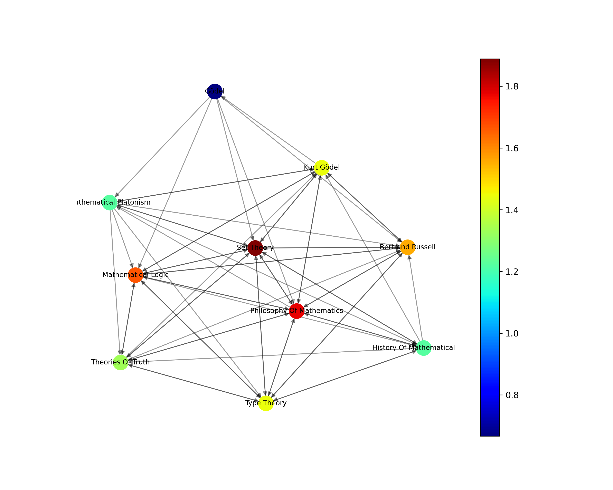
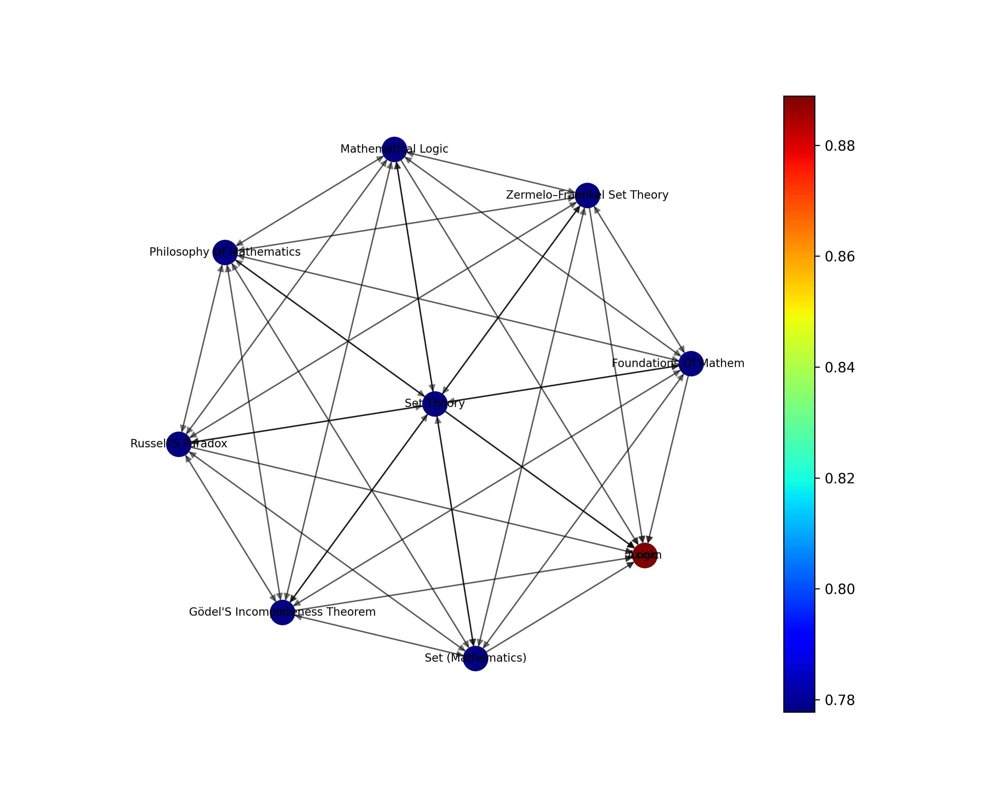
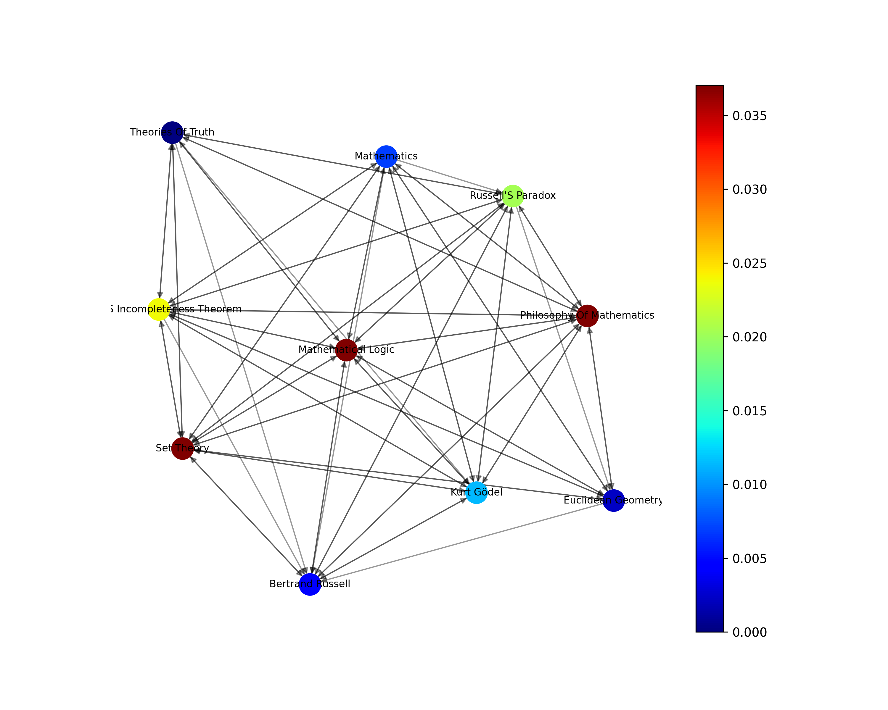
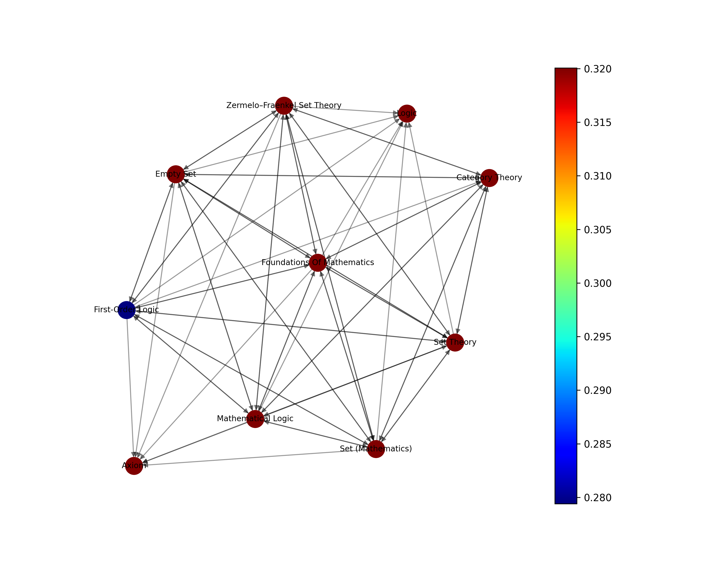
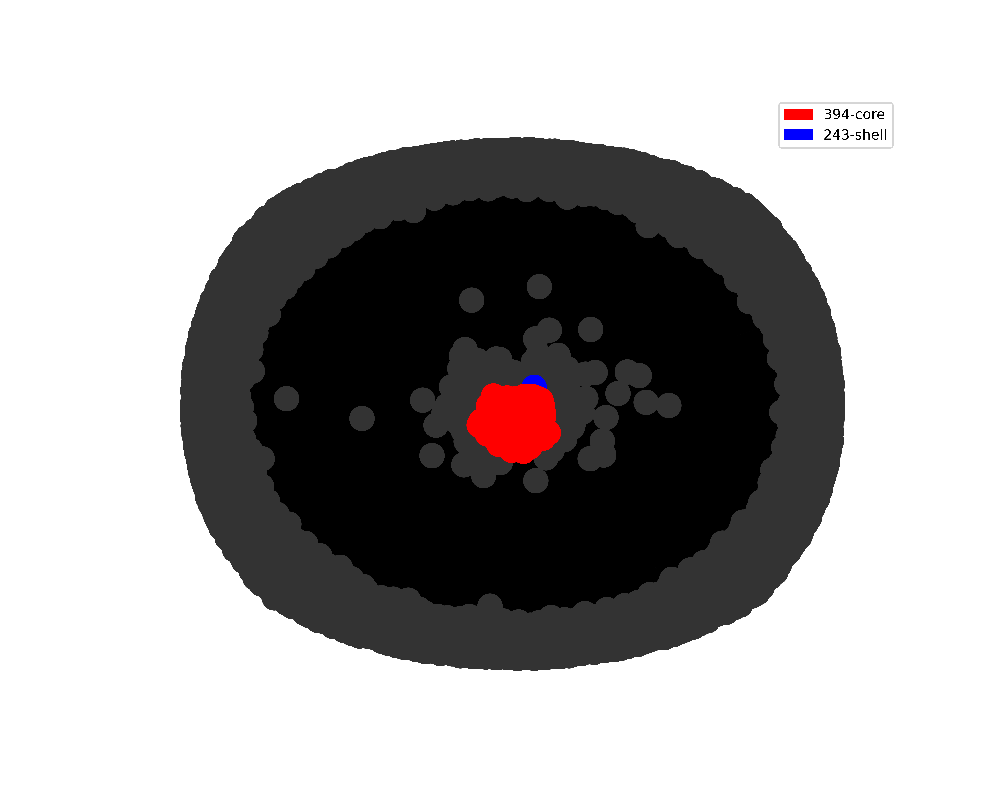
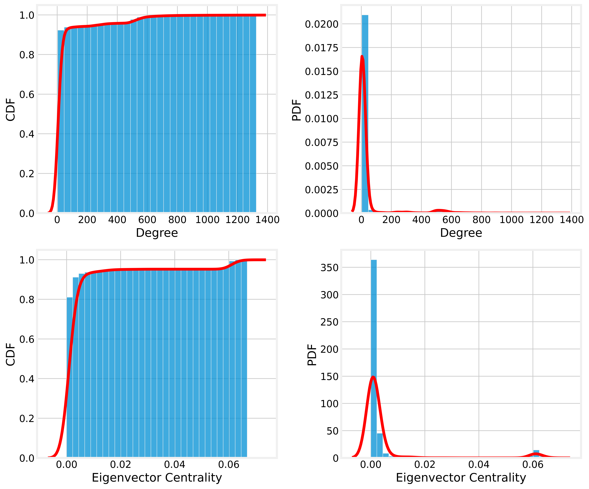
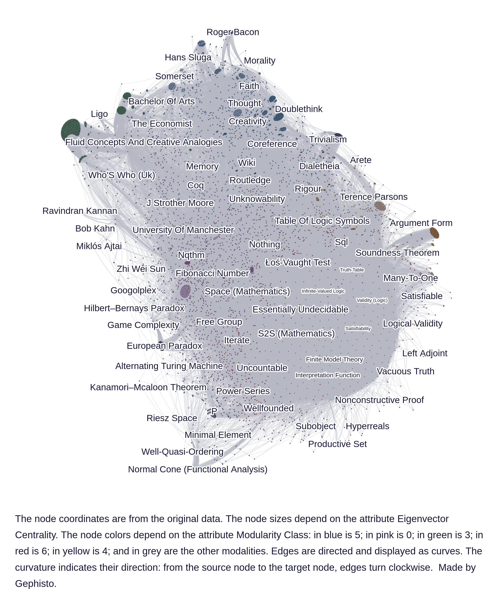

# Análise de páginas da Wikipédia
## Introdução
Este projeto é um componente da disciplina Algoritmo e Estrutura de Dados 2 oferecida na Universidade Federal do Rio Grande do Norte. O principal objetivo deste esforço é criar uma rede direcionada (gráfico) usando links de páginas da Wikipédia e realizar uma análise abrangente usando conceitos de rede. O processo de geração da rede começa com uma página específica da Wikipédia e é limitado a um nível de profundidade 2. A seleção dos teoremas da incompletude de Gödel foi feita como base para a geração da rede.

## Pipeline de dados
O pipeline de dados compreende quatro tarefas essenciais. O nó inicial é responsável por buscar dados de uma semente especificada e construir o gráfico. O nó subsequente elimina quaisquer nós duplicados, enquanto o terceiro nó filtra os nós com um grau menor que 2. Finalmente, o último nó combina cálculos e gera gráficos para várias métricas de rede, incluindo centralidade de grau, centralidade de proximidade, centralidade de intermediação e centralidade de autovetor. .

Execute o caderno
Para replicar os resultados apresentados, basta executar o caderno e modificar o título da página para o desejado.

pipeline.run("Página da Wikipédia")

Link do Vídeo: 

## Limpeza de dados
A versão inicial do grafo direcionado gerado a partir dos "Teoremas da Incompletude de Godel" consistia em 24.342 nós e 119.354 arestas. Após a remoção das duplicatas, o gráfico foi refinado para 24.090 nós e 119.049 arestas. Finalmente, ao filtrar todos os nós com grau um, o gráfico resultante foi reduzido para 5.447 nós e 97.550 arestas.
## Network Metrics

## Métricas de rede
Centralidade de Grau
Mede o número de conexões (arestas) que um nó possui em uma rede, em relação ao número total de conexões possíveis. Representa a importância ou influência de um nó com base na proporção de conexões diretas que possui em comparação com todas as conexões possíveis na rede. Os nós com maior grau de centralidade são frequentemente considerados mais centrais ou influentes na rede.

Os 10 principais nós com maior centralidade de grau:

### Centralidade de proximidade
Quantifica o quão próximo um nó está de todos os outros nós de uma rede. Ele mede o comprimento médio do caminho mais curto de um nó para todos os outros nós. Nós com alta centralidade de proximidade são normalmente capazes de alcançar outros nós de forma rápida e eficiente, agindo como intermediários de informações ou pontes na rede.

Abaixo estão os 10 principais nós que exibem um grau de centralidade mais alto:

### Centralidade de intermediação
Identifica nós que atuam como intermediários ou pontes entre outros nós em uma rede. Ele quantifica com que frequência um nó se encontra nos caminhos mais curtos entre pares de nós. Os nós com alta centralidade de intermediação têm controle significativo sobre o fluxo de informações e podem facilitar a comunicação entre partes distintas da rede.

Abaixo estão os 10 principais nós que exibem uma centralidade de intermediação mais alta:

### Centralidade do autovetor
Atribui uma medida de importância aos nós com base em suas conexões diretas e na importância dessas conexões. Leva em consideração a centralidade dos vizinhos de um nó, atribuindo pontuações mais altas aos nós conectados a outros nós altamente centrais. Nós com alta centralidade de autovetor são influentes devido às suas conexões com outros nós influentes.

Abaixo estão os 10 principais nós que exibem uma centralidade de autovetor mais alta:

### K-core e K-shell
O maior k-core nesta rede foi determinado como 393, significando um grupo de nós altamente conectado. Este k-core representa um subconjunto coeso de páginas que estão intrinsecamente interconectadas entre si.

Além disso, descobriu-se que o maior k-shell nesta rede tem um valor de 294. Um k-shell refere-se a um subconjunto de nós que possuem um grau mínimo dentro da rede. Neste caso, o k-shell de 294 representa um grupo significativo de nós com um número mínimo de conexões com o resto da rede.

Essas descobertas lançam luz sobre a intrincada estrutura e interdependências dentro da rede de páginas da Wikipédia decorrentes dos Teoremas da Incompletude de Gödel. A existência de um k-core e k-shell robustos ressalta a natureza interconectada dos tópicos e conceitos associados a este proeminente teorema matemático.

## Distribuições de probabilidade
Primeiramente, focando na distribuição de graus, a função de densidade de probabilidade (PDF) revela que a maioria dos nós apresenta graus que variam de 0 a 50. Isso sugere que uma parcela significativa das páginas da rede possui conectividade relativamente baixa. No entanto, curiosamente, há uma pequena curva no PDF que surge entre o intervalo de 400 e 600. Isto indica a presença de um subconjunto de nós com graus notavelmente elevados, significando um grupo de páginas com um número substancial de conexões. Esses nós com altos graus desempenham um papel crucial na facilitação do fluxo de informações e na conexão de tópicos díspares dentro da rede.

Da mesma forma, ao examinar a PDF da centralidade do autovetor, surge uma tendência semelhante. A maioria dos nós está distribuída em torno de valores baixos de centralidade de autovetor, indicando que a maioria das páginas tem influência ou proeminência limitada dentro da rede. No entanto, existem exceções notáveis, como evidenciado pela presença de nós com altos valores de centralidade de autovetores. Esses nós têm uma importância significativa em termos de influência e centralidade na rede, provavelmente representando tópicos-chave ou conceitos fundamentais que têm um impacto generalizado em outras páginas.

Em resumo, as distribuições de probabilidade do grau e da centralidade do autovetor dentro da rede de páginas da Wikipedia a partir dos Teoremas da Incompletude de Gödel demonstram um padrão de maioria dos nós com valores baixos, enquanto um subconjunto de nós exibe altos graus e centralidade do autovetor. Estas distribuições destacam os vários níveis de conectividade e influência dentro da rede, enfatizando a importância de certos nós na formação da estrutura geral e do fluxo de informações dentro deste domínio.

## Emparelhar gráfico com métricas de rede
Ao examinar o gráfico de pares de métricas de rede dentro da rede direcionada de páginas da Wikipédia, começando pelos Teoremas da Incompletude de Gödel, surgiram alguns padrões intrigantes. Embora o gráfico de pares possa não fornecer insights abrangentes sobre a estrutura geral da rede, ele revela correlações notáveis ​​entre certas métricas e sugere a presença de clusters distintos nos dados.

Em primeiro lugar, o gráfico de pares indica uma correlação entre intermediação e grau. Esta correlação implica que nós com graus mais elevados tendem a ter maior influência em termos de fluxo de informação dentro da rede. Os nós com graus mais elevados atuam frequentemente como pontes cruciais, ligando tópicos díspares e facilitando a transferência de conhecimento entre diferentes áreas.

Da mesma forma, o gráfico de pares revela uma correlação entre centralidade e proximidade do autovetor. Esta correlação sugere que nós com maior centralidade de autovetores tendem a ter uma proximidade maior com outros nós dentro da rede. Esta proximidade permite que estes nós tenham um acesso mais eficiente e direto à informação, aumentando a sua centralidade e influência global na rede.

Além disso, a coluna do autovetor no gráfico de pares demonstra a presença de dois clusters distintos. O primeiro cluster representa nós mais populares, caracterizados por valores mais elevados de centralidade de autovetores. Esses nós populares provavelmente correspondem a tópicos ou conceitos que atraíram atenção e destaque significativos na rede. Por outro lado, o segundo cluster representa um grupo maior de nós que são relativamente menos populares, com valores de centralidade de autovetores mais baixos. Esses nós podem corresponder a tópicos menos conhecidos ou de nicho dentro da rede.

## Gephi Plots

### Visualização 

Utilizando o software Gephi, foi gerada uma visualização aprimorada de toda a rede, resultando em um enredo visualmente cativante. Aos nós foram atribuídas cores correspondentes às suas respectivas comunidades, que foram determinadas utilizando modularidade com resolução de 1,0. A rede é composta por 9 comunidades distintas, distribuídas da seguinte forma:

1. Rosa: Constituindo 24,55% dos nós
2. Verde: Compreende 22,25% dos nós
3. Azul: Representando 17,46% dos nós
4. Outras comunidades: Representando 35,74% dos nós

Nós com um grau de entrada superior a 250 são identificados exibindo seus nomes, enquanto o tamanho de cada nó é dimensionado proporcionalmente ao seu grau de entrada.

---- 

### Gráficos filtrados

Ao examinar o gráfico, torna-se aparente que há um aglomerado notável de nós rosa com um alto grau de conectividade. Por outro lado, as bordas do gráfico exibem vários nós com graus mais baixos. Ao filtrar o gráfico levando em consideração o grau de entrada, apenas uma porcentagem de nós e arestas é exibida:

| In-Degree | Nodes    | Edges   |
| --------- | -----    | -----   |
| 4         | 69.68%   | 93.53%  |
| 5         | 49.78%   | 87.15%  |
| 10        | 22.33%   | 74.85%  |
| 15        | 12.76%   | 67.25%  |
| 30        | 07.45%   | 61.68%  |
| 80        | 04.92%   | 54.10%  |

#### Graph with in-degree > 80

### K-core

ambém é possível usar o gephi para plotar o núcleo 343:

### Discente: Maria Elayne Carvalho de Souza
